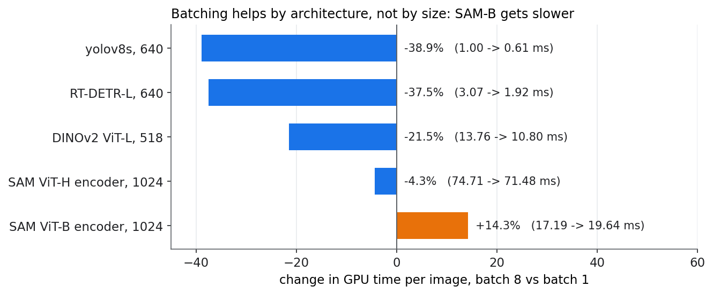

# Do big models batch? — and do weights matter?

Stage 3 runs large models on a fraction of flagged crops, and flagged crops arrive in
bursts, so they *could* be batched. Batch 8 saves yolov8s about 38% of its GPU time
per frame, because one small frame leaves most of the GPU idle. Does that carry over
to models that are already big?

Scripts: [`phase0_big_models.py`](https://github.com/sadbodhs/manufacturing_inspection/blob/main/scripts/phase0_big_models.py),
[`phase0b_sam_check.py`](https://github.com/sadbodhs/manufacturing_inspection/blob/main/scripts/phase0b_sam_check.py) ·
data: [`phase0_batching.tsv`](https://github.com/sadbodhs/manufacturing_inspection/blob/main/results/phase0_batching.tsv),
[`phase0b_weights.tsv`](https://github.com/sadbodhs/manufacturing_inspection/blob/main/results/phase0b_weights.tsv),
[`phase0b_profile.tsv`](https://github.com/sadbodhs/manufacturing_inspection/blob/main/results/phase0b_profile.tsv)

---

## Batching helps by architecture, not by size

Engine-level, 3 interleaved repeats (all within 0.3%). GPU time per image:

| Model | Input | Batch 1 | Batch 8, per image | Change |
|---|---|---:|---:|---:|
| yolov8s *(stage 1, reference)* | 640 | 0.998 ms | 0.609 ms | **−38.9%** |
| RT-DETR-L | 640 | 3.067 ms | 1.916 ms | **−37.5%** |
| DINOv2 ViT-L/14 | 518 | 13.76 ms | 10.80 ms | **−21.5%** |
| SAM ViT-H image encoder | 1024 | 74.71 ms | 71.48 ms | −4.3% |
| SAM ViT-B image encoder | 1024 | 17.19 ms | 19.64 ms | **+14.3%** |

The expectation was a smooth decline: the bigger the model, the less idle GPU there is
to fill, the less batching helps. That is not what happens. DINOv2-L, fourteen times
yolov8s's cost, still saves 21.5%. And SAM-B gets **slower** per image when batched.

## Why SAM-B gets slower

A layer profile of both engines (`trtexec --dumpProfile`) puts the whole slowdown in
attention. Per image, the attention layers cost 4.28 ms at batch 1 and 8.14 ms at
batch 8: **+3.86 ms, more than the net +2.45 ms**; the rest of the network saves about
1.4 ms. The layers that grow most are four `gemm_mha_v2` kernels (+1.8 ms per image
each) and four relative-position adds (+0.53 ms each).

Four is the number that explains it. SAM-B's encoder mostly attends inside 14 × 14
windows, but **four of its twelve blocks attend globally**, over all 4,096 tokens of a
1024 image. At batch 8, TensorRT runs those four through a kernel whose cost per image
is higher than at batch 1. Windowed attention batches well; global attention over a
large token grid does not, at least with the kernels TensorRT 10.7 picks here.

**For stage 3:** batching flagged crops is worth it for a detector like RT-DETR and a
backbone like DINOv2, and not for SAM's encoder. Design stage 3 for latency first, and
batch only the models that measurably benefit.

## Weights do not matter; the export does

Every model on this site is timed with random weights, on the premise that GPU time
depends on structure, not learned values. Phase 0 tested that against the companion
repo's model zoo, whose engines were exported with pretrained weights. DINOv2-L matched
(13.76 vs 13.65 ms, +0.8%), but both SAM encoders ran 8–10% **faster** with random
weights. That had to be explained before anything else here could be trusted.

The two exports differ in more than weights: they came from different code, months
apart. So Phase 0b isolated the weights on **one graph**, the model zoo's own SAM-B
ONNX:

| SAM-B encoder, batch 1 | GPU (median of 3) |
|---|---:|
| Model zoo's graph, pretrained weights | 18.748 ms |
| Model zoo's graph, every weight randomized (same mean and spread) | 18.708 ms (**−0.2%**) |
| This site's export, random weights | 17.004 ms (**−9.3%**) |

**Weights do not change the timing**: −0.2% is inside the noise. The 9% is the export
graph. And the export difference is not visible at the level of operations: the two
graphs have identical op counts except 117 `Identity` nodes, which do nothing and
disappear at build time. Repeat builds of either graph agree within 1%, so it is not
build-to-build variance either. What differs is how the same operations are wired,
and TensorRT fuses them differently.

The practical lesson: **re-exporting the same model from different code can move its
speed by ~9% with no op-level difference**. Compare engines only when they were
exported the same way. That is why every phase on this site uses one shared export
harness.

## What was predicted

Committed before the engines were built:

| | Prediction | Measured | |
|---|---|---|---|
| P1 | The batching saving falls as batch-1 time rises; above ~10 ms, under 10% | DINOv2-L (13.8 ms) saves 21.5%; SAM-B inverts to +14.3% | **failed** (yolov8s and SAM-H landed on their predicted values) |
| P2 | SAM-H does not fit batch 8 on 24 GB | built and ran at batch 8 | **failed** |
| P3 | Random-weight engines within ±3% of the zoo's pretrained ones | DINOv2-L +0.8%; SAM −8 to −10% | **failed** for SAM, explained by 0b |
| 0b P1 | Same graph, pretrained vs randomized: within ±1% | −0.2% | **held** |
| 0b P2 | The gap is a different attention decomposition in the graph | op counts identical except no-op Identity nodes | **failed**: the gap is real but not op-level |
| 0b P3 | SAM-B's batch-8 slowdown is in its 4 global-attention blocks | 4 attention kernels + 4 position adds carry it | **held** |
