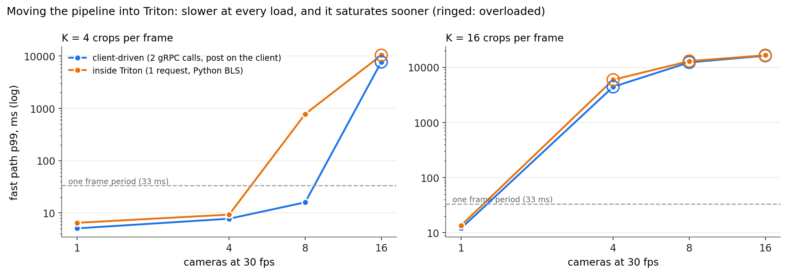

# Inside Triton — the pipeline as one server-side request

The [live line](the-line.md) is driven by its client: for every frame it makes two
gRPC calls (stage 1, then stage 2), and between them it does stage 1's
post-processing on the GPU and the CPU and cuts the crops with its own kernel.
Triton can run that orchestration itself. A **BLS** model (Business Logic
Scripting, Triton's Python backend) receives one request per frame and calls the
other models from inside the server.

On paper that should be faster: one network round trip instead of two, and no
host-side synchronisation between the stages. This page measures it.

The BLS model takes the frame (through the same CUDA shared memory) and the frame's
*K* crop boxes, then, all on the GPU inside the server:

- calls **stage 1** (yolov8s);
- runs the same candidate filter and class-aware NMS as the client, with
  torch/torchvision;
- cuts the crops with `roi_align` (one bilinear sample per pixel, the same resize as
  the client's kernel);
- calls **stage 2** with the crops as a GPU tensor (DLPack, no copy);
- returns the *K* scores.

Four Python instances, so several cameras' frames can be in flight. Stage 3 is not
part of this comparison: fast path only, *p* = 0. Cameras 1–16, *K* = 4 and 16,
3 repeats; the client-driven arm was re-measured in the same session.

Model: [`triton/bls/model.py`](https://github.com/sadbodhs/manufacturing_inspection/blob/main/triton/bls/model.py) ·
data: [`phase2_sweepD.tsv`](https://github.com/sadbodhs/manufacturing_inspection/blob/main/results/phase2_sweepD.tsv)

---

## Slower at every load, and it saturates sooner

| | Client-driven | Inside Triton (BLS) |
|---|---:|---:|
| *K* = 4, 1 camera, p50 | **4.90 ms** | 6.08 ms (+24%) |
| *K* = 4, 4 cameras, p50 / p99 | **5.40 / 7.75 ms** | 7.14 / 9.30 ms |
| *K* = 4, 8 cameras | 100% delivered, p99 16 ms | 95.1% delivered, p99 780 ms |
| *K* = 4, capacity | **9.8 cameras** | 7.7 cameras (−22%) |
| *K* = 16, 1 camera, p50 | **11.82 ms** | 13.05 ms (+10.4%) |
| *K* = 16, capacity | **3.1 cameras** | 2.8 cameras (−9%) |

**The server-side pipeline loses everywhere.** At one camera it is 1.2 ms slower per
frame. The round trip it removes is worth less than what the Python backend adds:
each BLS request crosses from Triton's core to a Python process and back, twice more
for the two inner calls, and the post-processing runs as a handful of small torch
operations instead of one fused kernel. At 8 cameras it is on the edge of overload
(95.1% of frames delivered, just above this site's 95% threshold, with a 780 ms
tail), where the client-driven line has half its frame period to spare. Its capacity
at *K* = 4 is 22% lower.

A likely contributor, **not verified here**: each of the four Python instances is its
own process with its own CUDA context (four ~320 MB processes appear on the GPU while
it runs), and separate CUDA contexts time-slice the GPU rather than share it. The
companion study measured that kind of contention between processes, and that
[MPS removes it](https://sadbodhs.github.io/computer_vision_optimization/contention/).

At *K* = 16 the gap shrinks to 10% at one camera and 9% in capacity: stage 2's
batch of 16 dominates the frame, so the orchestration overhead is a smaller share.

**What this does not test.** Only the Python BLS backend was measured. A C++ custom
backend, or a Triton ensemble with the post-processing in a TensorRT plugin, would
avoid the Python process and might behave differently. For a pipeline shaped like this
one, and orchestrated with Triton's Python tools, the client is the faster place to
drive it.

## What was predicted

Written before the BLS model had run. The predictions were committed after one
8-second smoke run that already showed BLS slower at one camera; they were committed
unchanged, and the commit says so.

| | Prediction | Measured | |
|---|---|---|---|
| D1 | At 1 camera BLS is faster by 0.3–1.0 ms (K=4) | 1.18 ms **slower** | **failed** |
| D2 | Under load BLS loses 10–30% of capacity at K=4 | −22% (7.7 vs 9.8 cameras) | **held** |
| D3 | At K=16 the arms differ by < 10% at 1 camera | +10.4% | **failed**, narrowly |
