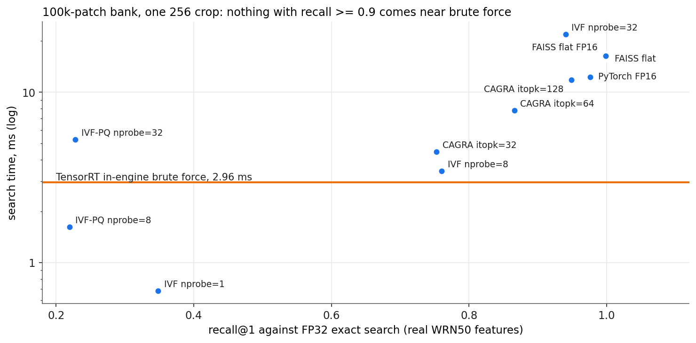

# Faster embedding search — do FAISS or cuVS beat brute force?

[PatchCore's search](patchcore-search.md) found the memory bank, not the backbone,
setting the cost past ~20k patches: 3.6 ms per crop at a 100k bank. Nearest-neighbour
search over embeddings is a solved problem with dedicated libraries, so the obvious
question is whether they do the job faster than a brute-force matrix multiply inside
TensorRT.

Candidates, all on the GPU with bank and queries already resident:

| | Method | Returns |
|---|---|---|
| exact | PyTorch FP16 brute force (the in-engine maths, unfused) | the nearest neighbour, up to FP16 rounding |
| exact | FAISS `GpuIndexFlatL2`, FP32 and FP16 | the nearest neighbour |
| approximate | FAISS IVF-Flat (cluster the bank, search `nprobe` clusters) | *probably* the nearest |
| approximate | FAISS IVF-PQ (also compress each embedding to 64 bytes) | *probably* the nearest |
| approximate | cuVS CAGRA (graph search built for GPUs) | *probably* the nearest |

Script: [`phase1a2_search.py`](https://github.com/sadbodhs/manufacturing_inspection/blob/main/scripts/phase1a2_search.py) ·
data: [`phase1a2_search.tsv`](https://github.com/sadbodhs/manufacturing_inspection/blob/main/results/phase1a2_search.tsv)
(and [`_run1`](https://github.com/sadbodhs/manufacturing_inspection/blob/main/results/phase1a2_search_run1.tsv), see below)

---

## Why this page uses real features

An approximate index can always be made faster by returning worse neighbours, so its
speed means nothing without its **recall**. Recall depends on how the embeddings are
distributed, and random-weight features are not distributed like real ones. So this
page, unlike every other on the site, uses **pretrained** WideResNet-50-2 features of
real images (COCO val2017 crops): a bank from 110 images (112,640 patches, subsampled
to 10k and 100k) and queries from 16 others. Two numbers per setting:

- **recall@1**: how often the index returns the true nearest neighbour
- **image-score error**: how far the image score (the max over patches of the
  nearest-neighbour distance, which is what PatchCore thresholds) moves

This is **search fidelity, not defect accuracy**: it says how faithfully each index
reproduces exact search on real features, nothing about finding defects.

## At PatchCore's query shape, brute force wins

100k bank, one 256 crop (1,024 query patches):

| Method | Time | recall@1 | Image-score error |
|---|---:|---:|---:|
| **TensorRT in-engine FP16 brute force** ([PatchCore's search](patchcore-search.md)) | **2.96 ms** | not measured* | not measured* |
| PyTorch FP16 brute force (unfused) | 12.2 ms | 0.976 | 0.02% |
| FAISS flat, FP32 (exact) | 16.0 ms | 1.000 | 0 |
| FAISS flat, FP16 | 16.3 ms | 0.999 | 0.002% |
| FAISS IVF, nprobe 1 | 0.68 ms | 0.348 | 4.16% |
| FAISS IVF, nprobe 8 | 3.45 ms | 0.760 | 1.24% |
| FAISS IVF, nprobe 32 | 21.8 ms | 0.940 | 0.33% |
| FAISS IVF-PQ, nprobe 8 | 1.62 ms | 0.219 | 3.66% |
| cuVS CAGRA, itopk 64 | 7.8 ms | 0.866 | 0.76% |
| cuVS CAGRA, itopk 128 | 11.8 ms | 0.949 | 0.43% |

\* The TensorRT engine was timed on random features, so its fidelity was not measured.
*Measured later on [What search costs the GPU](search-footprint.md#time), with real
features and a different 100k bank: recall@1 0.88, image-score error 0.18%. TensorRT
runs the distance arithmetic itself in FP16, so it loses more near-ties than PyTorch.*
It runs the same FP16 maths as the PyTorch row, which agrees with exact search on 97.6%
of neighbours with a 0.02% score error.

**No index with recall ≥ 0.9 comes within 4× of TensorRT's brute force.** The only
settings faster than it return the true neighbour a third of the time or less.

The reason is the query shape. PatchCore asks a thousand questions per crop (4,096 at
512), each a 1,536-dimension vector. Exact search over a thousand queries at once is
one large dense matrix multiply, which is exactly what tensor cores are built for,
and TensorRT runs it in FP16 fused with the norms and the min. The indexes are built
for the opposite shape: few queries against banks of millions to billions, where
touching every entry is impossible and skipping most of them pays. At 100k entries
and a thousand queries, touching every entry *is* the fast path.

Two smaller findings:

- **TensorRT's fusion is worth 4×.** The same FP16 maths in PyTorch, as separate
  operations, takes 12.2 ms against TensorRT's 2.96 ms.
- **The image score is forgiving.** IVF-PQ finds the true neighbour only 22% of the
  time, yet the image score moves just 3.7%. A miss returns a neighbour a little
  farther away than the true one, and the score is a max over a thousand patches, so
  individual misses rarely move it far.

**At a 10k bank none of this matters:** TensorRT's search adds 0.31 ms per crop, and
every library setting with useful recall costs more than that (the one that is
about as fast, IVF at nprobe 1, finds the true neighbour a third of the time).

These are single-GPU, single-crop-shape results. An index can still win with a much
larger bank (millions of patches), with far fewer queries per call, or when the bank
does not fit in GPU memory. None of those describe PatchCore on one fixture.

## A correction made during the run

The first run scored recall against the PyTorch FP16 brute force as the reference.
FAISS's FP32 exact search then disagreed with that reference on 1.1–2.4% of
neighbours: FP16 rounding flips near-ties. So the FP16 search is itself an
approximation, and cannot be the reference. The published run scores every method,
FP16 brute force included, against **FP32 exact search**. Timings did not change
(run-to-run ratio 1.00, rows within 7%); only recall and score error were
re-referenced. The first run is kept as
[`phase1a2_search_run1.tsv`](https://github.com/sadbodhs/manufacturing_inspection/blob/main/results/phase1a2_search_run1.tsv).

A method note: this page times library calls from Python (median of 50 calls after
10 warm-ups, synchronised), while the TensorRT row comes from `trtexec`. The Python
path adds tens of microseconds per call, which does not change any conclusion at
these millisecond scales.

## What was predicted

| | Prediction | Measured | |
|---|---|---|---|
| P1 | FAISS flat ≥ 2× faster than brute force at 100k with 4,096 queries | 64 ms vs 37 ms (PyTorch) and 11.5 ms (TensorRT) | **failed** |
| P2 | IVF-Flat nprobe 8: 5–20× faster than exact, recall ≥ 0.9, error < 1% | 4.6× faster than FAISS exact, recall 0.76, error 1.24% | **failed** |
| P3 | IVF-PQ is the fastest FAISS option; recall < 0.8 but error < 5% | recall 0.22, error 3.7%; IVF nprobe 1 is faster | **partly held** |
| P4 | At 10k none of it pays more than moving the features out (0.24 ms) | every library ≥ 0.29 ms; TensorRT adds 0.31 ms | **held** |

Next: [what each of these methods costs in GPU memory and time](search-footprint.md), and which to use when.
