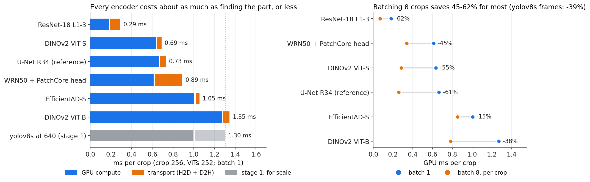

# Which encoders — what a good-parts-only anomaly model costs to run

Stage 2 of the [inspection pipeline](index.md) scores every part crop with
an anomaly model trained on good parts only. This page times the encoders those
methods are built on, as TensorRT FP16 engines, to pick which ones the rest of
the section carries forward.

Script: [`inspection_encoders.py`](https://github.com/sadbodhs/manufacturing_inspection/blob/main/scripts/inspection_encoders.py) ·
raw data: [`results/inspection_encoders.tsv`](https://github.com/sadbodhs/manufacturing_inspection/blob/main/results/inspection_encoders.tsv)
(medians) and [`inspection_encoders_raw.tsv`](https://github.com/sadbodhs/manufacturing_inspection/blob/main/results/inspection_encoders_raw.tsv)
(every repeat)

---

## The candidates

Each one is exported **the way its method consumes it**, so the output size,
and therefore the transport cost, is the real one:

| Encoder | Used by | What leaves the engine |
|---|---|---|
| **WRN50 + PatchCore head**: WideResNet-50-2 to layer 3, with PatchCore's pooling, upsampling and concatenation in the graph | PatchCore, the standard baseline | 1536 × 32 × 32 features (6.3 MB) |
| **EfficientAD-S**: teacher, student and autoencoder, with the anomaly map combined in the graph | EfficientAD, built for real-time inspection | a 1 × 256 × 256 anomaly map |
| **DINOv2 ViT-S/14** and **ViT-B/14**, patch tokens | AnomalyDINO | 324 tokens × 384 or 768 |
| **ResNet-18**, layers 1–3 | PaDiM, STFPM, FastFlow; the cheap floor | three feature maps (1.8 MB) |
| **U-Net R34**, 3-channel output | DRAEM-style reconstruction; **reference only** | a reconstructed crop |

Crops of 256 and 512 for the CNNs, 252 and 504 for the ViTs (patch 14), batch 1
at both sizes and batch 8 at the small one: 18 engines. Random weights, since
timing depends on structure. Each engine is built once and timed in 3
interleaved rounds with `trtexec`'s default window; the tables show medians.
The three repeats agree to within 1.5% everywhere.

## At a 256 crop, every encoder costs less than finding the part

Batch 1, sorted by total cost per crop:

| Encoder | Params | GPU | H2D + D2H | **Total** | Transport share |
|---|---:|---:|---:|---:|---:|
| ResNet-18 L1–3 | 2.8 M | 0.180 ms | 0.110 ms | **0.290 ms** | 38% |
| DINOv2 ViT-S | 21.7 M | 0.634 ms | 0.055 ms | **0.689 ms** | 8% |
| U-Net R34 *(reference)* | 24.4 M | 0.665 ms | 0.067 ms | **0.732 ms** | 9% |
| WRN50 + PatchCore head | 24.9 M | 0.612 ms | 0.278 ms | **0.889 ms** | 31% |
| EfficientAD-S | 8.1 M | 1.005 ms | 0.049 ms | **1.055 ms** | 5% |
| DINOv2 ViT-B | 85.8 M | 1.271 ms | 0.074 ms | **1.346 ms** | 6% |
| *yolov8s at 640 (stage 1, for scale)* | 11.2 M | 0.987 ms | 0.300 ms | *1.287 ms* | 23% |

Three things stand out.

**EfficientAD-S is not a light network.** It has the fewest parameters of any
real candidate, but it is the most expensive CNN: 1.64× the WRN50 backbone at
256 and **2.58× at 512**. Its four wide, dense convolutions do far more work per
parameter than a ResNet does. Its real-time reputation comes from the method,
not the network: it produces its anomaly map directly, where PatchCore still has
to search a memory bank of good-part features after the backbone. Whether WRN50
plus that search beats EfficientAD-S is [PatchCore's search](patchcore-search.md).

**PatchCore's features are heavy to move.** 6.3 MB leaves the engine at 256,
and 25 MB at 512, where copying them back takes **0.96 ms against 1.48 ms of
compute** (42% of the frame). Doing the nearest-neighbour search inside the
graph, which Phase 1a tests, should remove almost all of it: the search returns
a score and a small map, not the features.

**The cheapest encoder is mostly transport.** ResNet-18 computes in 0.18 ms
but spends 0.11 ms moving its three feature maps: 38% of its frame at 256, 57%
at 512. The same lesson as [moving fewer bytes](https://sadbodhs.github.io/computer_vision_optimization/fewer-bytes/), now for
features rather than images.

## Doubling the crop costs 1.8× to 3.8×, not 4×

| Encoder | GPU at 256/252 | GPU at 512/504 | Ratio (4× the pixels) |
|---|---:|---:|---:|
| ResNet-18 L1–3 | 0.180 ms | 0.327 ms | 1.82× |
| U-Net R34 | 0.665 ms | 1.234 ms | 1.86× |
| WRN50 + PatchCore head | 0.612 ms | 1.481 ms | 2.42× |
| DINOv2 ViT-S | 0.634 ms | 1.738 ms | 2.74× |
| DINOv2 ViT-B | 1.271 ms | 4.060 ms | 3.19× |
| EfficientAD-S | 1.005 ms | 3.826 ms | 3.81× |

A ratio well under 4× means the small crop was not filling the GPU, so launch
and scheduling overhead were a large part of its cost. EfficientAD-S scales
almost linearly with pixels: it is already compute-bound at 256.

## Batching crops pays off far more than batching frames

A frame with several parts in it is a ready-made batch. Per-crop GPU time at
batch 8, against batch 1:

| Encoder | Batch 1 | Batch 8, per crop | Saving |
|---|---:|---:|---:|
| ResNet-18 L1–3 | 0.180 ms | 0.069 ms | **−61.5%** |
| U-Net R34 | 0.665 ms | 0.258 ms | **−61.2%** |
| DINOv2 ViT-S | 0.634 ms | 0.284 ms | **−55.3%** |
| WRN50 + PatchCore head | 0.612 ms | 0.338 ms | **−44.7%** |
| DINOv2 ViT-B | 1.271 ms | 0.784 ms | −38.4% |
| EfficientAD-S | 1.005 ms | 0.854 ms | −15.0% |

For comparison, batch 8 saves yolov8s at 640 **37%** per frame
([batching](https://sadbodhs.github.io/computer_vision_optimization/batching/)). Most of these encoders save more, because a small
crop leaves more of the GPU idle. EfficientAD-S saves least, for the same reason
it scales linearly: there was little idle GPU left to fill. Whether that saving
survives live camera load is [the whole line](the-line.md)'s
first sweep.

## What was predicted

Written into the script and committed before any engine was built
(commit [`4400d76`](https://github.com/sadbodhs/computer_vision_optimization/commit/4400d76), made in the companion repo before this one existed):

| | Prediction | Measured | |
|---|---|---|---|
| P1 | ResNet-18 is the fastest: ~0.15 ms at 256, ~0.45 at 512 | 0.180 / 0.327 ms | **held** |
| P2 | WRN50 ~1.1 ms at 256, ~4.2 at 512; ~0.25 ms D2H, ~20% transport | 0.612 / 1.481 ms; D2H 0.244 ms; 31% | **failed** on compute (2–3× too high); D2H held |
| P3 | EfficientAD-S is slower than the WRN50 backbone: ~2 ms at 256, ~8.5 at 512 | 1.005 / 3.826 ms, 1.64× / 2.58× WRN50 | **held** in direction; about 2× too high |
| P4 | ViT-S ~0.4 ms at 252 and cheaper than WRN50; ViT-B ~1.0 / ~3.9 ms | ViT-S 0.634 ms (GPU tie with WRN50, cheaper in total); ViT-B 1.271 / 4.060 ms | **failed** at 252; ViT-B at 504 held |
| P5 | U-Net ~0.35 ms at 256, ~1.2 at 512 | 0.665 / 1.234 ms | **failed** at 256, held at 512 |
| P6 | Batch 8 saves most where batch 1 is launch-bound: ResNet-18 and ViT-S ~40%, U-Net ~25%, WRN50 ~15%, EfficientAD-S <10% | 61 / 55 / 61 / 45 / 15% | **failed** on size: every saving underestimated; EfficientAD-S smallest, as predicted |
| P7 | ResNet-18's feature maps make transport ~40% of its frame | 38% | **held** |

Two held, one held in direction, the rest failed. The pattern in the misses is
one error made twice. Scaling from FLOP counts overestimated the big dense
networks, which TensorRT runs efficiently (WRN50, EfficientAD-S). It
underestimated the small ones, whose cost at 256 is mostly fixed overhead
(U-Net, ViT-S). At these crop sizes the fixed overhead is a large part of the
bill, which is also why batching pays so well.

## Carried forward

The decision rule, set before the run, was: the standard baseline, the fastest
real-time method, and one ViT only if it is within reach at 256.

- **WRN50 + PatchCore**, the standard baseline, into the [search-cost test](patchcore-search.md).
- **EfficientAD-S**, the one candidate whose whole method is already in the
  graph, and the dense-map case for [map or score](dense-output.md).
- **DINOv2 ViT-S**, within reach: level with WRN50 on GPU time and cheaper in
  total. ViT-B, at twice the cost, is not carried.

ResNet-18 is measured and stays the floor: whatever method runs on it, the
backbone costs 0.18 ms. U-Net was a reference and is done.

