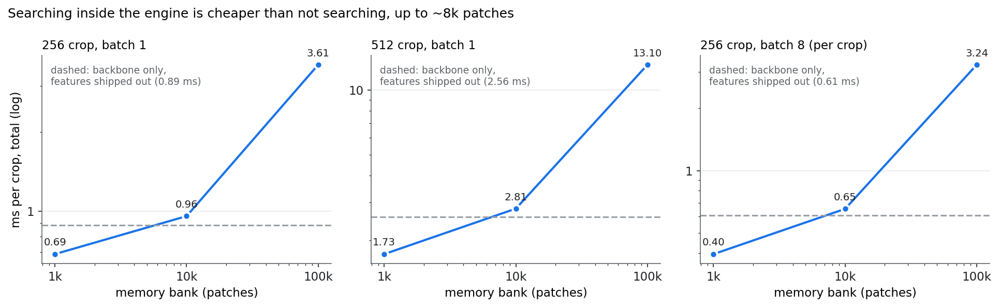

# PatchCore's search — backbone or memory bank?

PatchCore keeps a memory bank of patch features from good parts. At inference every
patch of the crop is compared with every bank entry, and a patch's anomaly score is
the distance to its nearest neighbour. The [encoder check](encoders.md) timed only the
backbone, and found its output heavy to move: 6.3 MB per crop at 256, 25 MB at 512.

Here the search moves **inside the TensorRT engine**, so only a score and a small map
leave it:

```
d²(patch, bank) = |f|² − 2·f·Bᵀ + |B|²      one matrix multiply
patch score     = min over the bank        one reduction
image score     = max over patches;  map = patch scores at 1/8 resolution
```

The bank is a graph constant, random, standing in for a coreset of good-part patches.
Real banks are a coreset of 1–10% of all training patches: 200 good images at 256
give about 205k patches, so 1k, 10k and 100k span a small fixture to a large one.

Script: [`phase1a_patchcore.py`](https://github.com/sadbodhs/manufacturing_inspection/blob/main/scripts/phase1a_patchcore.py) ·
data: [`phase1a_patchcore.tsv`](https://github.com/sadbodhs/manufacturing_inspection/blob/main/results/phase1a_patchcore.tsv)

---

## Below ~8k patches, searching is cheaper than not searching

Total per crop (GPU + transport), median of 3 interleaved repeats:



| | 256, batch 1 | 512, batch 1 | 256, batch 8 |
|---|---:|---:|---:|
| Backbone only, features shipped out | 0.886 ms | 2.562 ms | 0.607 ms |
| + search, 1k bank | **0.688 ms (−22%)** | **1.726 ms (−33%)** | **0.395 ms (−35%)** |
| + search, 10k bank | 0.959 ms | 2.807 ms | 0.654 ms |
| + search, 100k bank | 3.607 ms | 13.100 ms | 3.245 ms |

With a small bank, the engine that *also searches* is cheaper than the engine that
only computes features, because the search costs less than copying 6–25 MB of
features out of the GPU. The break-even is at about **8k patches**, at every size and
batch. A fixture with a small, tight coreset should always search inside the engine.

Past about **20k patches, the bank sets the cost**, not the backbone. At 100k the
search is 5× the backbone at 256 and 8× at 512. The search time is linear in bank size
(×9.5 from 10k to 100k) and grows ×3.9 from a 256 to a 512 crop, with 4× the
patches.

Batching barely helps the search. At 100k, batch 8 saves exactly 10% per crop: the
search is already one large matrix multiply per crop.

Whether a real embedding-search library does better than this brute force is the
next page: [faster embedding search](embedding-search.md).

## What was predicted

| | Prediction | Measured | |
|---|---|---|---|
| P1 | The search adds ~0.1 / 0.7 / 6 ms at 256, ~4× that at 512 | adds 0.04 / 0.31 / 2.96 ms; ×3.9 at 512 | **held in shape**, sizes ~2× too high |
| P2 | With a 1k or 10k bank, searching beats shipping features at 512 | 1k: 1.73 vs 2.56 ms; 10k: 2.81 vs 2.56 | **half held** |
| P3 | Past ~10k the bank sets the cost; at 100k, 10× EfficientAD-S | bank dominates past ~20k; 100k is 3.4× EfficientAD-S | **partly held** |
| P4 | Batch 8 saves < 10% per crop at 100k | exactly 10.0% | **at the boundary** |
