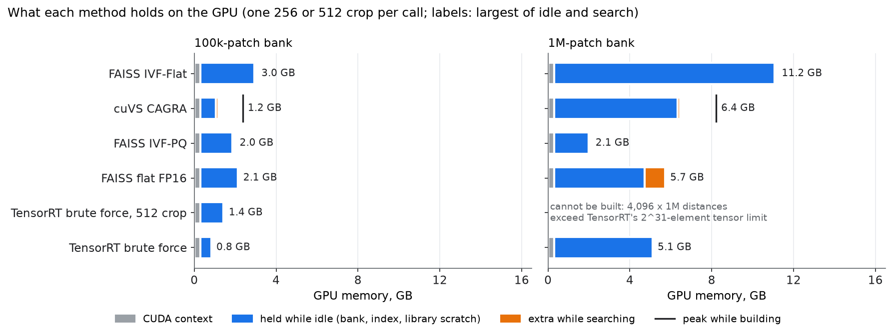
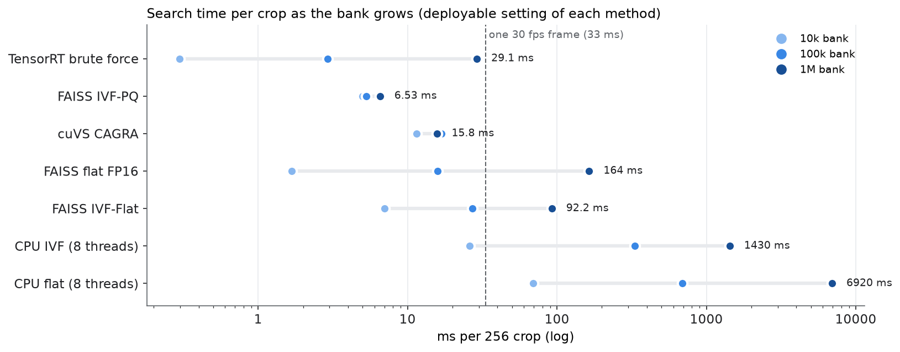
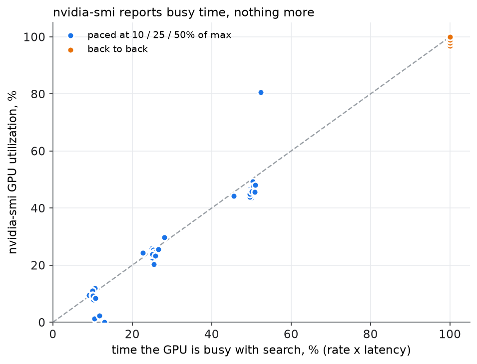

# What search costs the GPU — memory, time and headroom

[Faster embedding search](embedding-search.md) asked which method finds PatchCore's
nearest neighbours fastest. This page asks what each one **costs**: how much GPU
memory it holds, how much GPU time each crop takes, and therefore how much of the
card is left for the other models that share it. Each method is measured **alone**,
on an otherwise empty GPU, so the numbers are its own and nothing else's.

Scripts: [`phase5_prep.py`](https://github.com/sadbodhs/manufacturing_inspection/blob/main/scripts/phase5_prep.py) ·
[`phase5_worker.py`](https://github.com/sadbodhs/manufacturing_inspection/blob/main/scripts/phase5_worker.py) ·
[`phase5_driver.py`](https://github.com/sadbodhs/manufacturing_inspection/blob/main/scripts/phase5_driver.py) ·
[`phase5_ncu.py`](https://github.com/sadbodhs/manufacturing_inspection/blob/main/scripts/phase5_ncu.py) ·
[`phase5_nsys.sh`](https://github.com/sadbodhs/manufacturing_inspection/blob/main/scripts/phase5_nsys.sh) ·
data: [`phase5_memory.tsv`](https://github.com/sadbodhs/manufacturing_inspection/blob/main/results/phase5_memory.tsv),
[`phase5_speed.tsv`](https://github.com/sadbodhs/manufacturing_inspection/blob/main/results/phase5_speed.tsv),
[`phase5_sweep.tsv`](https://github.com/sadbodhs/manufacturing_inspection/blob/main/results/phase5_sweep.tsv),
[`phase5_ncu.tsv`](https://github.com/sadbodhs/manufacturing_inspection/blob/main/results/phase5_ncu.tsv),
raw [`phase5_footprint_raw.jsonl`](https://github.com/sadbodhs/manufacturing_inspection/blob/main/results/phase5_footprint_raw.jsonl)

---

## The short answer

- **Every GPU method pays 0.3 GB before it holds any data** (the CUDA context).
  **FAISS pays another 1.55 GB** of scratch memory on top, so a tiny 10k-patch bank
  costs 1.9 GB in FAISS against 0.4 GB in TensorRT.
- **Memory grows with the bank, at very different rates.** At 1M patches: IVF-PQ
  holds 2.0 GB, TensorRT brute force 5.1 GB, FAISS flat 4.7 GB (5.7 GB while
  searching), CAGRA 6.3 GB (8.2 GB while building) and IVF-Flat 11.1 GB.
- **Brute-force time grows with the bank; graph and compressed search barely do.**
  From 100k to 1M, TensorRT goes from 2.9 to 29 ms per crop, while CAGRA stays at
  ~16 ms and IVF-PQ goes from 5.3 to 6.5 ms.
- **TensorRT's distance table can outgrow TensorRT itself.** A 512 crop against a 1M
  bank needs a 4,096 × 1,000,000 table, which exceeds TensorRT's limit of 2^31
  elements per tensor: the engine cannot be built at all.
- **nvidia-smi's "GPU utilization" cannot rank these methods.** It reads 97–100% for
  every one of them running flat out, and tracks busy *time* when they are paced. How
  hard the GPU actually works inside that time differs by method
  ([below](#nvidia-smi-utilization-measures-time-not-load)).
- **The CPU is not a real-time option past ~10k patches**: 26 ms per crop at 10k on 8
  cores, 0.3–7 seconds at 100k–1M.

The [guidelines](#what-to-use-when) at the end turn this into a choice per situation.

## What was measured

| Method | What it is | Setting used |
|---|---|---|
| TensorRT brute force | the in-engine search of [PatchCore's search](patchcore-search.md), backbone removed: one matrix multiply and a min, FP16, bank as an engine constant | one engine per crop size |
| FAISS flat FP16 | FAISS exact search, bank stored in FP16 | — |
| FAISS IVF-Flat | bank split into ~4√N clusters; search only the `nprobe` nearest | nprobe 32 (8 also timed) |
| FAISS IVF-PQ | IVF plus each vector compressed to 64 bytes | nprobe 32 (8 also timed) |
| cuVS CAGRA | graph search built for GPUs | itopk 128 (64 also timed) |
| CPU flat / CPU IVF | FAISS on 8 CPU threads, no GPU at all | IVF nprobe 32 |

The "setting used" is the one with the best recall each method offers here; the
faster settings are in the [data](https://github.com/sadbodhs/manufacturing_inspection/blob/main/results/phase5_speed.tsv).

- **Data**: real pretrained WideResNet-50-2 patch features of 1,000 COCO images
  (1M patches). The 10k and 100k banks are nested subsets of the 1M. Recall is scored
  against FP32 exact search on 16 other images, as on
  [the search page](embedding-search.md#why-this-page-uses-real-features).
- **Query**: one crop per call, 256 × 256 (1,024 patches) or 512 × 512 (4,096).
- **Isolation**: every (method, bank) runs in a **fresh process**, so its fixed cost is
  measured from zero. GPU memory and utilisation are sampled from *outside* the process
  with NVML every ~2 ms, so they include every allocator's cache: what the card really
  has to hold. Three repeats in shuffled order; medians reported (memory was identical
  in all three, timings varied by a median of 1%).
- **Card**: RTX 3090, 24 GB.

## Memory

GPU memory in GB, at three bank sizes. *Idle* is what the method holds between calls;
*search* is the peak during a call (the larger of the 256 and 512 crop);
*build* is the peak while building the index.

| Method | 10k idle / search | 100k idle / search / build | 1M idle / search / build |
|---|---|---|---|
| TensorRT brute force, 256 crop | **0.38 / 0.38** | **0.83 / 0.83 / 0.81** | 5.11 / 5.11 / 5.09 |
| TensorRT brute force, 512 crop | 0.45 / 0.47 | 1.41 / 1.44 / 1.39 | cannot be built |
| FAISS flat FP16 | 1.88 / 1.88 | 2.14 / 2.14 / 2.12 | 4.72 / 5.72 / 4.72 |
| FAISS IVF-PQ | 1.86 / 1.96 | 1.87 / 1.97 / 1.87 | **1.98 / 2.07 / 1.94** |
| cuVS CAGRA | 0.61 / 0.65 | 1.05 / 1.18 / 2.37 | 6.32 / 6.45 / 8.21 |
| FAISS IVF-Flat | 2.00 / 2.09 | 2.94 / 3.03 / 2.94 | 11.08 / 11.17 / 11.08 |
| CPU flat or IVF | 0 GPU (0.06 GB of RAM) | 0 GPU (0.57 GB of RAM) | 0 GPU (5.7 GB of RAM) |

Where the memory goes:

- **CUDA context: 0.30 GB**, the same for every GPU method. It is the price of using
  the GPU from a process at all, and every *process* pays it once.
- **FAISS scratch: 1.55 GB.** FAISS reserves a block of temporary memory the first
  time an index runs (10k flat: 1.88 GB held for a 0.03 GB bank). It is the same for
  every FAISS index and does not grow with the bank. This run uses FAISS's default;
  FAISS lets you shrink the reservation, which this page did not test.
- **The bank itself.** FP16 storage is 3 KB per patch (TensorRT, FAISS flat):
  2.9 GB at 1M. IVF-Flat and CAGRA keep **FP32** vectors (6 KB per patch), and IVF-Flat
  holds 9.2 GB above its scratch for a 5.7 GB bank, about 1.6× the vectors. IVF-PQ
  compresses each vector to 64 bytes plus an ID: 0.12 GB above its scratch at 1M,
  **23× smaller** than the FP16 bank.
- **TensorRT's distance table.** The engine materialises a crop-patches × bank table of
  distances: 0.2 GB for a 256 crop at 100k, 0.8 GB for a 512 crop, 1.9 GB for a 256 crop
  at 1M. It is reserved for the engine's lifetime, so it counts as *idle* memory. At
  512 × 1M the table would be 4.1 billion elements; TensorRT refuses to build it (its
  per-tensor limit is 2^31). That case has to be searched in four 1,024-patch chunks.
- **Building is a separate peak.** CAGRA needs 8.2 GB while building a 1M graph,
  1.9 GB more than it keeps.
- **Batching queries raises the peak.** FAISS IVF-Flat reached 5.1 / 6.0 / 14.2 GB
  during the recall check, which searches 16 crops in one call. One crop per call, as
  in the table, stays within 0.1 GB of idle.

## Time

Per 256 crop at each method's setting above. **Cameras** is how many 30 fps cameras
one GPU could serve with one crop per frame, if it did nothing but search
(max crops/s ÷ 30). Recall and image-score error are against FP32 exact search.

| Method | 10k: ms · cameras | 100k: ms · cameras | 1M: ms · cameras | recall@1 (10k / 100k / 1M) | image-score error, 1M |
|---|---|---|---|---|---|
| TensorRT brute force | **0.30 · 101** | **2.93 · 11** | 29.1 · 1.1 | 0.92 / 0.88 / 0.76 | 0.28% |
| FAISS IVF-PQ | 5.00 · 6.6 | 5.28 · 6.3 | **6.53 · 5.1** | 0.43 / 0.35 / 0.20 | 4.4% |
| cuVS CAGRA | 11.5 · 2.9 | 16.9 · 2.0 | 15.8 · 2.1 | 1.00 / 0.99 / 0.90 | 1.0% |
| FAISS flat FP16 | 1.68 · 20 | 15.8 · 2.1 | 164 · 0.2 | 1.00 / 1.00 / 1.00 | 0.003% |
| FAISS IVF-Flat | 6.99 · 4.7 | 27.2 · 1.2 | 92.2 · 0.4 | 0.94 / 0.90 / 0.90 | 0.45% |
| CPU IVF, 8 threads | 26.0 · 1.3 | 331 · 0.1 | 1,432 · 0.02 | 0.94 / 0.91 / 0.90 | 0.45% |
| CPU flat, 8 threads | 69.6 · 0.5 | 692 · 0.05 | 6,923 · 0.005 | 1.00 / 1.00 / 1.00 | 0 |

A 512 crop (4× the patches) costs 3–4× a 256 crop for every method.

- **Brute force scales with the bank; so does exact FAISS.** 10× the bank is 9.9×
  the time for TensorRT and 10.4× for FAISS flat. TensorRT stays 5.4–5.7× faster
  than FAISS flat at every size: one fused FP16 kernel against a general library.
- **CAGRA and IVF-PQ are nearly flat in bank size.** CAGRA's graph walk visits about
  the same number of nodes whatever the bank, and IVF-PQ scans compressed codes. Extending
  TensorRT's straight line between the measured sizes, IVF-PQ overtakes it near 200k
  patches and CAGRA near 550k.
- **TensorRT's FP16 arithmetic loses near-ties.** Its recall falls from 0.92 to 0.76 as
  the bank grows, because more bank entries sit almost equally close and FP16 rounding
  flips them. FAISS flat FP16 stores FP16 but adds up in FP32 and keeps 0.999. The
  image score barely notices: 0.2–0.3% error, because a near-tie miss returns a
  neighbour at almost the same distance.
- **IVF-PQ's recall is low, but its score error is bounded.** It finds the true
  neighbour 20–43% of the time, yet moves the image score only 4–5%, as
  [before](embedding-search.md).

## nvidia-smi "utilization" measures time, not load

The number `nvidia-smi` and most dashboards call **GPU utilization** is the fraction of
the last sampling period in which *any* kernel was running. Paced at 10%, 25% and 50% of
its maximum rate, every method's reading lands on the busy-time line (44 of 45 points
within 15 points of it); run flat out, every method reads 97–100%.

It says nothing about how much of the GPU those kernels use while they run. Nsight
Compute measures that directly, kernel by kernel, for one 256 crop:

| Method | compute units busy (% of peak) | memory bandwidth busy (% of peak) | nvidia-smi |
|---|---:|---:|---:|
| TensorRT brute force | **85 / 86** | 63 / 64 | 100% |
| FAISS flat FP16 | 73 / 73 | 62 / 63 | 100% |
| FAISS IVF-PQ | 64 / 64 | 64 / 66 | 100% |
| cuVS CAGRA | 29 / 29 | 83 / **87** | 99% |
| FAISS IVF-Flat | 34 / 28 | **97 / 97** | 100% |

*100k / 1M bank, one 256 crop. Percentages are averaged over the call's kernels,
weighted by each kernel's time. The last column is the back-to-back reading.*

Three different kinds of load, all reported as "100%":

- **TensorRT brute force is compute-bound**: one tensor-core matrix multiply keeps the
  compute units at 85% of their peak. While it runs, there is little compute left for
  a model running beside it.
- **CAGRA and IVF-Flat are memory-bound**: the compute units idle at 28–34% while the
  memory bus runs at 83–97%. They leave arithmetic free but saturate the bandwidth
  every other model also needs.
- **IVF-PQ and FAISS flat sit in between.**

How much a second model slows down beside each method depends on which of the two it
needs. This page measures each method alone and does not test that.

Nsight Compute also reports kernel durations, but its capture included the warm-up
calls for FAISS and cuVS (four times the kernels an Nsight Systems timeline shows for
one call), so its times are not used. The timeline's kernel time per crop matches the
timed latency within 10% for every method at 100k and 1M (TensorRT 2.81 vs 2.93 ms,
CAGRA 15.7 vs 16.9 ms, FAISS flat 15.7 vs 15.8 ms;
[`phase5_nsys.tsv`](https://github.com/sadbodhs/manufacturing_inspection/blob/main/results/phase5_nsys.tsv)),
so the latencies in this page are GPU time: the GPU is busy for almost the whole call.

The points furthest off the line are the slowest calls (90–160 ms at 1M) and CAGRA at
100k, at the lowest rates, where a 4-second window holds only a handful of calls and
nvidia-smi's short sampling period catches or misses them unevenly.

**For planning, use GPU time per crop × crops per second, not utilization.** A method at
"50%" leaves half the GPU's *time*; how much other work can overlap in that time
depends on how much of the GPU each kernel occupies.

## The CPU option

The CPU methods use no GPU memory and no GPU time, so they leave the whole card to the
other models. They cost 7–8 CPU cores while searching and their index lives in RAM
(5.7 GB at 1M). The catch is speed: only at 10k patches does a crop finish inside one
30 fps frame (CPU IVF, 26 ms). At 100k a crop takes a third of a second; at 1M,
1.4 seconds even with IVF.

## What to use when

These follow from the measurements above on one RTX 3090, with PatchCore's query shape
(a thousand or more query patches per call). A different card scales the times, not
the ordering.

| Situation | Use | Why (numbers from this page) |
|---|---|---|
| **One product, bank up to ~100k patches** (a 1–10% coreset of a few hundred good images) | **TensorRT brute force inside the encoder engine** | 1.8–5.7× faster than the next method (0.3 ms at 10k, 2.9 ms at 100k), smallest memory (0.4–0.8 GB), no extra library or process. |
| **The bank is the cost; shrink it first** | **Coreset subsampling** (PatchCore's own step) | Brute-force time and memory are proportional to the bank: 10× fewer patches is 10× less of both. Cheaper than any index. |
| **512 crops or very large banks with TensorRT** | Split the query into 1,024-patch chunks | The distance table is patches × bank; at 512 × 1M it cannot be built at all. |
| **Bank of ~1M patches, recall matters** | **cuVS CAGRA** | 16 ms per crop whatever the bank size, recall 0.90. Budget 6.3 GB, and 8.2 GB while (re)building. |
| **Many products resident on one GPU, or memory is the hard limit** | **FAISS IVF-PQ** | Holds 1M patches in 0.12 GB above FAISS's fixed 1.85 GB; 6.5 ms per crop. Only if the anomaly threshold tolerates ~5% image-score error (recall 0.2–0.4). |
| **Sharing the GPU with other models** | Count each search *process* | 0.3 GB of CUDA context per process, plus 1.55 GB if it uses FAISS. Running search inside an existing TensorRT process avoids both. |
| **No GPU to spare, small bank (≤10k)** | **CPU IVF, 8 threads** | 26 ms per crop, zero GPU. Not past ~10k: 0.3 s at 100k. |
| **Avoid** | FAISS IVF-Flat; CPU flat | IVF-Flat holds more memory than exact search (11 GB at 1M), is slower than TensorRT up to 1M, and has lower recall. CPU flat is 0.07–7 s per crop. |
| **Judging headroom** | GPU-ms per crop × rate, and memory | nvidia-smi utilization is busy time. It reads ~100% for light and heavy kernels alike. |

## What was predicted

Written in [`phase5_worker.py`](https://github.com/sadbodhs/manufacturing_inspection/blob/main/scripts/phase5_worker.py)
before any worker ran.

| | Prediction | Measured | |
|---|---|---|---|
| F1 | Every GPU method pays ≥ 250 MB before data; FAISS ≥ 1 GB more, so at 100k FAISS flat's fixed cost exceeds its bank | 308 MB context; FAISS scratch 1,589 MB; at 100k it is 5× the 0.3 GB bank | **held** |
| F2 | At 1M above fixed cost: IVF-PQ < 0.25 GB; TensorRT and flat 2.9–3.5 GB; IVF-Flat and CAGRA ≥ 5.8 GB | IVF-PQ 0.12 GB; FAISS flat 2.86 GB, TensorRT bank 2.9 GB (+1.9 GB table); IVF-Flat 9.2 GB, CAGRA 6.0 GB | **held** |
| F3 | TensorRT at 512: table ≥ 0.8 GB at 100k; ≥ 8 GB at 1M, the largest peak there, or it does not fit | 793 MB at 100k (0.83 billion bytes: exactly the 4,096 × 100k FP16 table); at 1M it cannot be built | **held** (on its "does not fit" branch; of the methods that do fit, IVF-Flat's 11.2 GB is the largest) |
| F4 | nvidia-smi ≥ 90% flat out for every method, and within 15 points of busy time when paced | 97–100% flat out; 44 of 45 paced points within 15 (FAISS flat at 1M, 50% pace: 81% for 52% busy) | **held** |
| F5 | CPU flat at 100k ≥ 20× slower than FAISS flat on ≥ 6 cores; CPU IVF at 100k < 50 ms | 44× slower on 8.0 cores; CPU IVF **331 ms** | **partly held** |
| F6 | GPU latencies at 100k within 25% of the search page; TensorRT within 25% of 2.96 ms | flat −3%, IVF 8 +6%, IVF 32 +25%, IVF-PQ 8 −3%, TensorRT −1%; **CAGRA +31% and +43%** | **partly held** |
| F7 | 100k → 1M: exact search ≥ 8× slower; IVF at fixed nprobe ≤ 4× | exact 9.9× and 10.4×; IVF nprobe 32 3.4×, **nprobe 8 4.2×** | **mostly held** |

On F6: this page's 100k bank is drawn from 1,000 images; the search page's came from
110. A different bank builds a different CAGRA graph and different IVF clusters, which
moves both time and recall (CAGRA's recall at itopk 128 is 0.99 here and was 0.95
there). The exact methods, which do the same work whatever the bank, matched within 3%.

## Method notes

- **The first sweep was stopped and rerun.** The CPU methods first ran on the FAISS
  build that ships with the GPU package, whose bundled maths library (OpenBLAS 0.3.3)
  runs on one core whatever the thread setting: a 200k exact search took 8.7 s on 1.0
  core. The CPU-only FAISS package runs the same search in 1.39 s on 8.0 cores, so the
  CPU methods use it (FAISS 1.15.1; GPU methods FAISS 1.14.1). The sweep was restarted
  from scratch so every run uses the same code; the stopped run's seven GPU results are
  not used. Commit
  [c5e874c](https://github.com/sadbodhs/manufacturing_inspection/commit/c5e874c).
- **"1.0 CPU core" for the GPU methods** in the data is the harness waiting for each
  call with a spinning synchronise. A deployment that blocks on the GPU instead would
  use almost none.
- **GB here means 1,024 MB**, as NVML reports memory.
- **Build time** is paid once per bank. TensorRT engines took 2 s (10k), 15 s (100k)
  and 129 s (1M) to build; FAISS IVF-PQ 14 s and CAGRA 9 s at 1M; CPU IVF trained for
  5 minutes at 1M.
- **TensorRT's recall was not measured on the search page** (its engine ran on random
  features). This page measures it with real features: 0.92 / 0.88 / 0.76.
