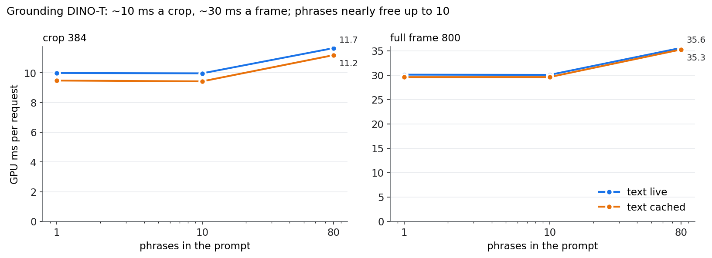

# Grounding DINO on TensorRT — what explaining a flag costs

Stage 3 turns "unusual" into "scratch on the left edge". An open-vocabulary detector
does that from a text prompt, so a new defect type needs a new phrase, not new
training. The candidate is **Grounding DINO (tiny)**: a Swin-T image backbone, a
BERT-base text encoder, image–text fusion layers and a 900-query decoder, built from
its default configuration with random weights.

Three questions: does it convert to TensorRT at all, what does a phrase cost, and
should the text encoding be cached? On a line the prompt set is fixed, so BERT's
output can be computed once: the **cached** variant replaces the text encoder with
its precomputed output, and **live** runs BERT on every request.

Script: [`phase1c_stage3.py`](https://github.com/sadbodhs/manufacturing_inspection/blob/main/scripts/phase1c_stage3.py) ·
data: [`phase1c_stage3.tsv`](https://github.com/sadbodhs/manufacturing_inspection/blob/main/results/phase1c_stage3.tsv)

---

## It converts, with one workaround

Grounding DINO has the parts that usually break a TensorRT conversion: deformable
attention (48 `GridSample` ops), a two-stage top-k query selection, and text masks
derived from where the `.` separators sit in the prompt. Only the last one failed:
the masks are computed with `torch.isin`, which has no ONNX export at opset 17.

The workaround follows from the deployment: the masks depend only on the token ids,
which are fixed for a prompt set, so they are computed once and handed to the traced
graph as constants. After that both variants export (13,057 and 12,354 ONNX nodes) and
all 12 engines build, well inside the one-hour cap set for the conversion.

A bug in the first version of that workaround is worth recording: the patched mask
function replaced the original module-wide, so the second engine built was handed the
first prompt's masks and failed on a shape mismatch. It was fixed, and the phase rerun
in full; the fix is in the repository history.

## What it costs

GPU time per request, batch 1, median of 3 interleaved repeats:

| | 1 phrase | 10 phrases | 80 phrases |
|---|---:|---:|---:|
| 384 crop, text live | 9.99 ms | 9.97 ms | 11.67 ms (+17%) |
| 384 crop, text cached | 9.48 ms | 9.43 ms | 11.19 ms |
| 800 frame, text live | 30.11 ms | 30.06 ms | 35.59 ms (+18%) |
| 800 frame, text cached | 29.60 ms | 29.60 ms | 35.26 ms |

**About 10 ms to explain a crop, 30 ms for a whole frame.** Sending the flagged crop
rather than the frame is 3× cheaper, not the 4.3× the pixel count suggests, because
the 900-query decoder does not shrink with the image.

**Phrases are nearly free up to ten.** One phrase and ten cost the same. Eighty
three-token phrases (242 tokens) add 17–18%, and the cost is in the image–text fusion
layers, not the text encoder.

**Caching the text saves a flat ~0.5 ms** whatever the phrase count: BERT-base over
242 tokens is cheap next to the rest. Worth doing, since it is free on a fixed prompt
set, but it is not what makes stage 3 expensive.

**What this means for the line:** one flagged crop costs about three times a whole
frame's fast path (stage 1 plus stage 2 is ~3–4 ms of GPU). A flag rate of a few
percent is therefore not a rounding error. [Under live load](the-line.md) measures
what it does to the fast path.

## What was predicted

| | Prediction | Measured | |
|---|---|---|---|
| P1 | Converts within the 1-hour cap after at least one workaround | one workaround (masks as constants) | **held** |
| P2 | ~15–25 ms at 800, ~5–9 ms at 384; the crop not 4.3× cheaper | 30.1 / 10.0 ms; 3.0× | **failed** on size, **held** in shape |
| P3 | 1 → 10 phrases adds < 10%; 80 adds 20–40% | −0.2%; +17–18% | **half held** |
| P4 | Caching saves ~1 ms at 10 phrases, ~2–3 ms at 80 | a flat ~0.5 ms | **failed** |
